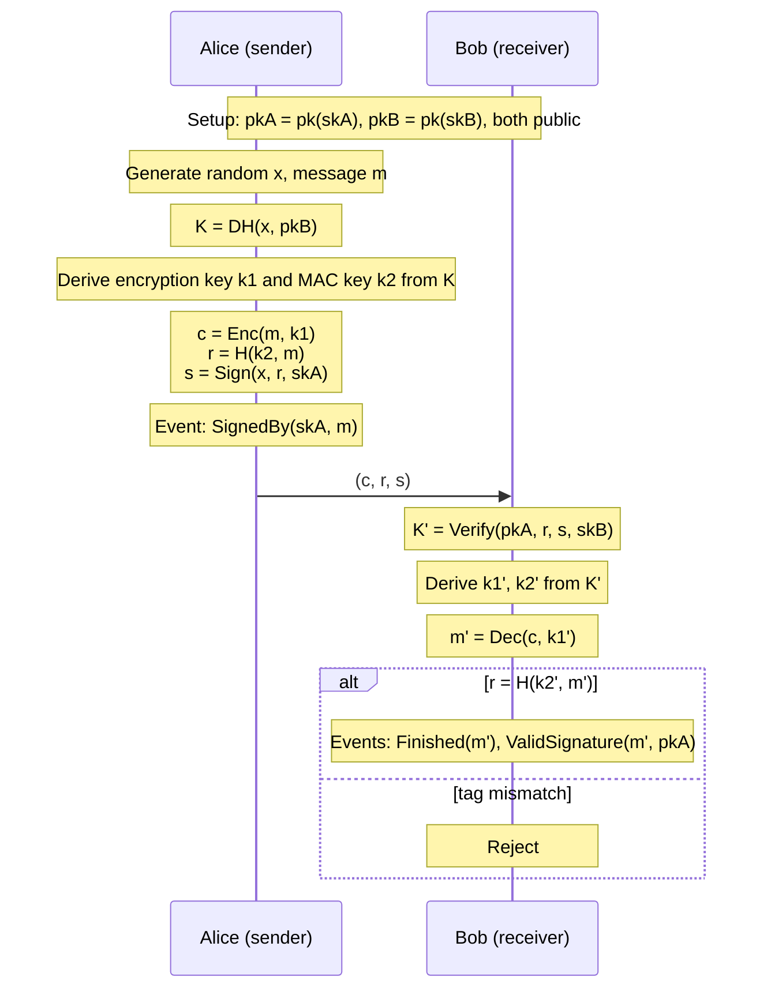

# Signcryption: protocol sequence diagram

```mermaid
sequenceDiagram
    participant A as Alice (sender)
    participant B as Bob (receiver)

    Note over A,B: Setup: pkA = pk(skA), pkB = pk(skB), both public

    Note over A: Generate random x, message m
    Note over A: K = DH(x, pkB)
    Note over A: Derive encryption key k1 and MAC key k2 from K
    Note over A: c = Enc(m, k1)<br/>r = H(k2, m)<br/>s = Sign(x, r, skA)
    Note over A: Event: SignedBy(skA, m)

    A->>B: (c, r, s)

    Note over B: K' = Verify(pkA, r, s, skB)
    Note over B: Derive k1', k2' from K'
    Note over B: m' = Dec(c, k1')
    alt r = H(k2', m')
        Note over B: Events: Finished(m'), ValidSignature(m', pkA)
    else tag mismatch
        Note over B: Reject
    end
```
