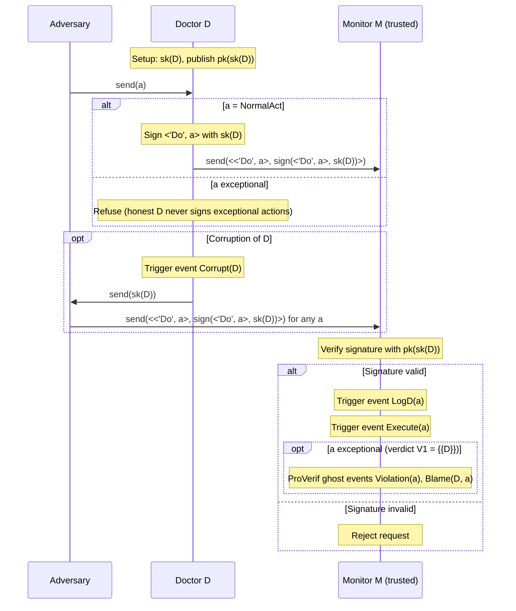

```mermaid
sequenceDiagram
    participant Adversary
    participant Doctor as Doctor D
    participant Monitor as Monitor M (trusted)

    Note over Doctor: Setup: sk(D), publish pk(sk(D))

    Adversary->>Doctor: send(a)
    alt a = NormalAct
        Note over Doctor: Sign <'Do', a> with sk(D)
        Doctor->>Monitor: send(<<'Do', a>, sign(<'Do', a>, sk(D))>)
    else a exceptional
        Note over Doctor: Refuse (honest D never signs exceptional actions)
    end

    opt Corruption of D
        Note over Doctor: Trigger event Corrupt(D)
        Doctor->>Adversary: send(sk(D))
        Adversary->>Monitor: send(<<'Do', a>, sign(<'Do', a>, sk(D))>) for any a
    end

    Note over Monitor: Verify signature with pk(sk(D))
    alt Signature valid
        Note over Monitor: Trigger event LogD(a)
        Note over Monitor: Trigger event Execute(a)
        opt a exceptional (verdict V1 = {{D}})
            Note over Monitor: ProVerif ghost events Violation(a), Blame(D, a)
        end
    else Signature invalid
        Note over Monitor: Reject request
    end
```
